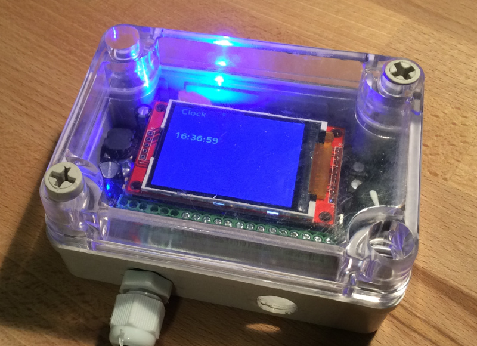
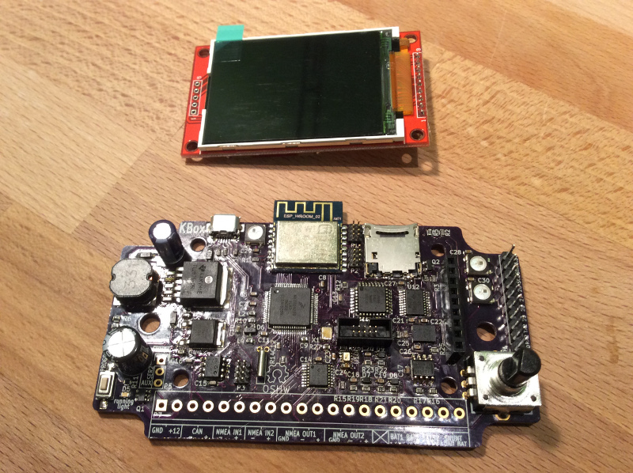

# KBox

KBox is an open-source platform to develop "smart boat" applications.

> This repository contains all the hardware files for this project. For firmware,
> please visit the [kbox-firmware](https://github.com/sarfata/kbox-firmware)
> repository.

KBox hardware includes:

 - One NMEA2000 interface,
 - Two NMEA0183 inputs (one of them can be used as a Seatalk input),
 - Two NMEA0183 outputs,
 - One WiFi interface that can connect to an existing network or create a new
   network on your boat,
 - Three analog inputs to measure voltages between 0 and 23V (batteries, solar
   panels, generators, etc),
 - One shunt input to measure current consumption of your main house battery,
 - One barometer,
 - One inertial measurement unit providing a magnetic compass, an accelerometer
   to measure roll, pitch and yaw as well as a gyroscope,
 - An SDCard to record data.

[Fine more news about KBox on
hackaday.io](https://hackaday.io/project/11055-kbox).

## How to get KBox?

KBox is an open-source hardware project. You can review the schematics and build
it yourself. We also intend to get a few batches manufactured by a professional
board assembly house. If you are interested, put your name in our form!

[I am interested in an early manufacturing batch](http://goo.gl/forms/y78AeACvyr).

## Schematics

Download the [PDF version of KBox
schematics](https://github.com/sarfata/kbox-hardware/releases/download/kbox-v1-revC/kbox-revC.pdf)
or use Kicad to open this project.

## Pictures

**Recommended waterproof enclosure.**

The board was designed to fit in this enclosure and you can easily include
multiple cable glands. The reference of this enclosure is DS-AT-0811-S. It is
available [from Adafruit](https://www.adafruit.com/products/903).

## License

The hardware files for KBox are distributed under the [Creative Commons -
Attribution ShareAlike 4.0
license](https://creativecommons.org/licenses/by-sa/4.0/legalcode).

You can share and adapt this project and redistribute it as long as you give
credit to the original authors, clearly indicate if changes were made, and you
re-distribute under a similar license.

## Contributors

- [Thomas Sarlandie](https://github.com/sarfata/)

To contribute to this project, please make a pull-request via GitHub and add
your name to the list of Contributors in that pull-request. Thanks!

## External libraries

A copy is automatically saved by KiCad in the `kbox-cache.lbr` file so you
should not need to have those installed in your computer.

Just in case, here is the list of 3rd party libraries used:

For the schematic:

 - [kicad_libs]: w_analog, w_device, conn
 - [gsg-kicad-lib]: gsg-symbols

For the PCB:

 - [kicad_libs]: w_smd_trans (will disappear soon), w_misc_comp (rotary encoder)
 - [gsg-kicad-lib]: gsg-modules (micro usb connector)

[kicad_libs]: git://smisioto.eu/kicad_libs.git
[gsg-kicad-lib]: git@github.com:greatscottgadgets/gsg-kicad-lib.git

### A note on git subtrees

This project use of git subtrees to reference footprints from various libraries
on the web. It works great and should make everyone's life easier but when you
need to pull changes from the original repo or push back some updates, it can be
slightly non trivial ...

So here is the best reference I have found:
https://hpc.uni.lu/blog/2014/understanding-git-subtree/

